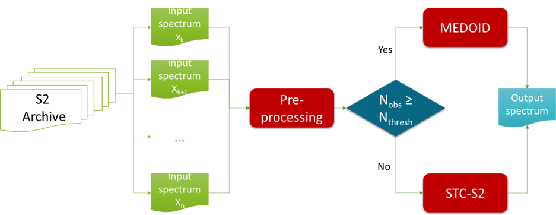

.. _mosaic_algos:

#####################
Mosaicking Algorithms
#####################

.. note::
   The content needs to be provided/edited by GK

The mosaic processing is organized in two distinct modules (see :numref:`mosaickingScheme`):

- the pre-processing module
- and a combined mosaicking module based on Medoid and Short-Term Composite approaches.

A threshold related to the number of valid observations is defined and applied in the processing chain for the selection of the mosaicking approach. In case of sufficient valid observations, the Medoid approach is selected otherwise the Short-Term composite is chosen. The threshold has been set to 4 for Mosaics V1.

.. _mosaickingScheme:

   Mosaicking Scheme

"Best" Pixel Approach
*********************

L2A Product Preparation
***********************

Algorithms
**********

Medoid
======

STC
===

QA / QC
*******

Processing System
*****************
