.. _mosaic_hub:

##############
The Mosaic Hub
##############

.. note::
   The content will be provided by UK

The Mosaic Hub front-end is the main tool for S2GM users.
It allows for the specification of S2GM products in terms of the spatial extent as well as the compositing period
and the format of the output products.
The front-end guides the user through the process of this product specification.
A registration is required before requesting and downloading mosaics.

Registration
************
For the registration process, guide your browser to the `Subscription Page <https://services.sentinel-hub.com/oauth/subscription>`_.
After you have filled out the form (see :numref:`mosaicHubRegistration`), you will receive an e-mail to confirm your
mail address. Click on the verification button and you will receive the confirmation that your account has been created.

.. _mosaicHubRegistration:
.. figure:: MosaicHubRegistration.png
   :name: mosaicHubRegistrationName
   :scale: 50%
   :alt: Mosaic Hub Registration
   :align: center

   Mosaic Hub Registration

Mosaic Ordering
***************
This page describes the process of ordering  mosaics, from defining the conditions to the download of the processed product.
The ordering of :ref:`time_series` is described below.

Mosaic Hub
==========

The Mosaic Hub is located `here <https://webdev.sentinel-hub.com/mosaic-hub/#/>`_.

However, in order to download the processed products, you will have to install the "Mosaic Downloader" App.
In fact, this App has the same functionality like the browser instance. In order to not have to switch between browser and
Mosaic Downloader, it might be more convenient to work with the App from the beginning.

Mosaic Downloader
=================
In the Mosaic Hub, click on the drop-down menu item "Mosaic Downloader" like in :numref:`mosaicDownloaderMenu`.

.. _mosaicDownloaderMenu:
.. figure:: MosaicDownloaderMenu.png
   :name: mosaicDownloaderMenuName
   :scale: 50%
   :alt: Mosaic Downloader Menu Item
   :align: center

   Mosaic Downloader Menu Item

From there, you are able to download the App for your specific OS, or even launch the App from the browser menu.
When you launch the App, you will see a window like in :numref:`mosaicDownloaderAppBase`.

.. _mosaicDownloaderAppBase:
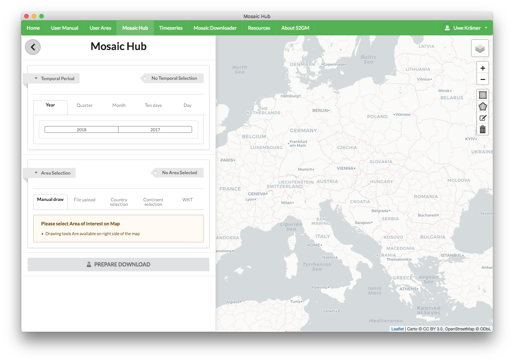

   Mosaic Downloader App Window (Base view)

.. _mosaicDownloaderAppS2:
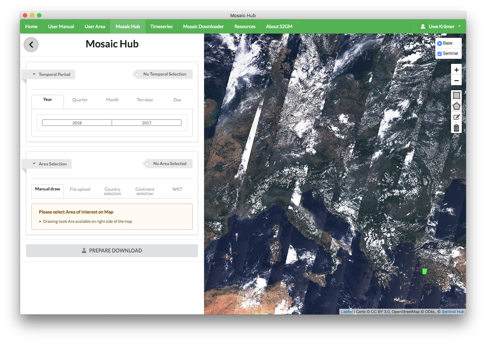

   Mosaic Downloader App Window (Sentinel view)

The menu of the App has menu buttons in the top; clicking on them brings up the following functionality:

+------------------------+------------------+
| Menu Button            |  Functionality   |
+========================+==================+
| Home                   | TBD              |
+------------------------+------------------+
| User Manual            | This document    |
+------------------------+------------------+
| User Area              | Status of Orders |
+------------------------+------------------+
| Mosaic Hub             | Configuration    |
|                        | of Mosaics       |
+------------------------+------------------+
| Time Series            | Configuration    |
|                        | of Time Series   |
+------------------------+------------------+
| Mosaic Downloader      | Configuration    |
|                        | and Execution    |
|                        | of Downloads     |
+------------------------+------------------+
| Resources              | TBD              |
+------------------------+------------------+
| About S2GM             | TBD              |
+------------------------+------------------+

The App Window is separated vertically with the dynamic map on the right and the temporal and spatial
configuration options on the left. Users can scroll and zoom into the map to focus on an area of interest.

Area Selection
--------------

.. _areaSelection:
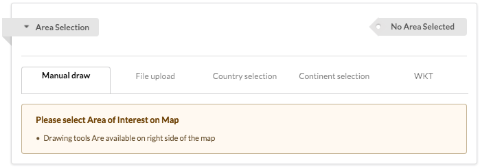

   Area Selection

As depicted in :numref:`Fig. {number}: {name} <areaSelection>`, there are different options to define the area for which the mosaic product will be generated:

Note that your product might be split into several tiles if it spans a large area (see also the warning displayed on :numref:`orderPanelOrder`).

* Drawing a rectangular or a polygon of arbitrary geometry on the map after selecting the corresponding icon in the menu on the upper right of the map (see :numref:`drawingTools`).
* Uploading a kml or kmz shape file. The upload button is located on the second tab in the area selection menu of the configuration menu.
* Selection of a pre-defined area, i.e. a country or a continent, in the dropdown menus of the configuration menu.
* Entering the area boundaries in WKT format (see :numref:`Fig. {number}: {name} <WKT>`.
  Note that in WKT the first and last co-ordinates must be identical to close the polygon.

.. _drawingTools:

   Drawing Tools

.. _WKT:
.. figure:: WKT.png
   :name: wktName
   :alt: WKT Example
   :align: center

   WKT Example

Compositing Periods
-------------------
The definition of the compositing period is done in the temporal period section of the configuration menu.
There are five different compositing lengths to choose from: year, season, month, 10-day, day.
For each of these compositing lengths, pre-defined periods can be selected by choosing the desired option in the corresponding tabs.
Unavailable periods are disabled and marked in grey colour. In the 10-day and the day tabs, one can select months and years
from drop-down lists. The forward and backward scrolling can be done by clicking on the arrow symbol.

.. _compositingYear:
.. figure:: CompositingPeriodYear.png
   :name: compositingYearName
   :scale: 50%
   :alt: Compositing Dialog (Year)
   :align: center

   Compositing Dialog (Year)

As it can be seen in :numref:`compositingYear`, one can select a complete year as compositing period by clicking on it.

.. _compositingQuarter:
.. figure:: CompositingPeriodQuarter.png
   :name: compositingQuarterName
   :scale: 50%
   :alt: Compositing Dialog (Quarter)
   :align: center

   Compositing Dialog (Quarter)

Select a three-month period by clicking on the buttons Q1-Q4 (:numref:`compositingQuarter`).

.. _compositingMonth:
.. figure:: CompositingPeriodMonth.png
   :name: compositingMonthName
   :scale: 50%
   :alt: Compositing Dialog (Month)
   :align: center

   Compositing Dialog (Month)

The selection of the desired month as compositing period is straightforward (:numref:`compositingMonth`).

.. _compositing10Days:
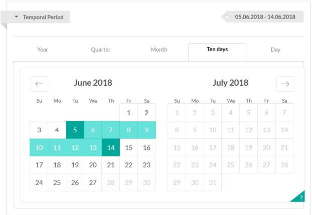

   Compositing Dialog (10 days)

The definition of a ten-days period is bound to pre-defined, fixed intervals.
The latter are displayed on the specific tab. Start- and end-days are marked in dark green,
the intermediate values in light green (see :numref:`compositing10Days`). Clicking on either day in the interval yields the same result.

.. _compositingDay:
.. figure:: CompositingPeriodDay.png
   :name: compositingDayName
   :scale: 50%
   :alt: Compositing Dialog (Day)
   :align: center

   Compositing Dialog (Day)

The selection of the desired month as compositing period is straightforward (:numref:`compositingDay`).

.. _orderPanel:

Once area of interest and compositing period have been selected, users must define further properties in the Order Panel dialogue.
Click on "**PREPARE DOWNLOAD**" to enter the Order Panel. You will have to walk through four tabs and make your choices.
On the last tab, you will be able to resume your selections. In the first tab the data format has to be defined (see :numref:`orderPanelData`).

.. _orderPanelData:
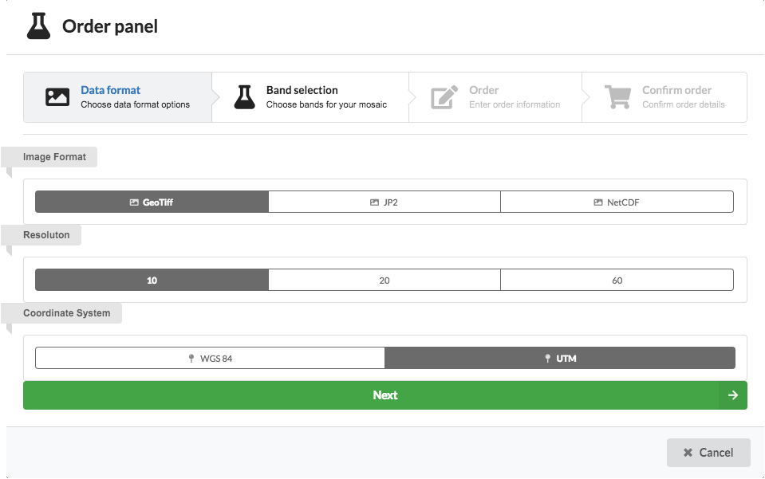

   Order Panel (Data format)

Make your choice and click on "**Next**". This brings you to the next tab of the Order Panel.
Here you can select the bands that shall be included in the product (see also :ref:`prod_guide`).
Apart from the surface reflectance bands, additional bands can be selected under "**Advanced Settings**" (see :numref:`orderPanelBands`).

.. _orderPanelBands:
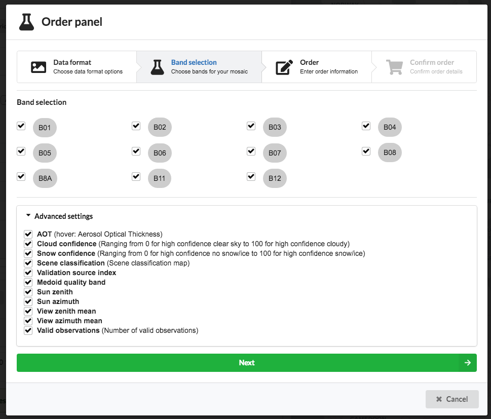

   Order Panel (Bands)

Click on "**Next**". The next page is used to assign a name to your specific order (:numref:`orderPanelOrder`).
Assign the name in such a way that it is as meaningful as possible. This way you will be able to distinguish your processings better later on.

.. _orderPanelOrder:
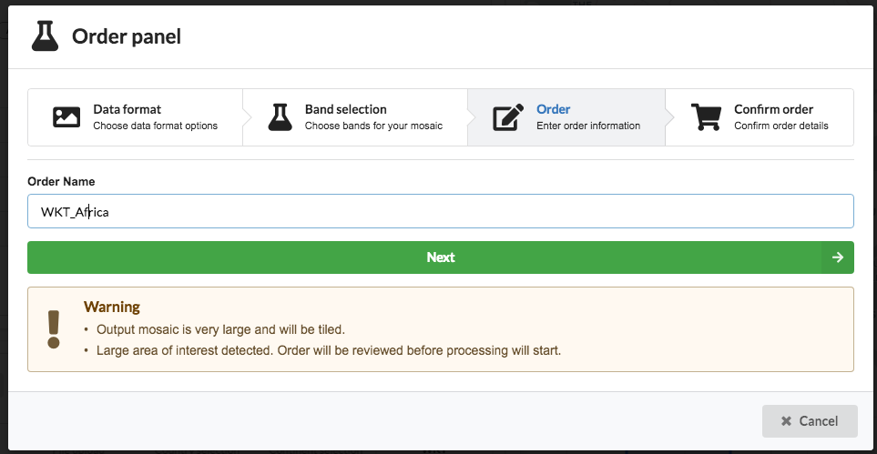

   Order Panel (Order information)

Note that

Click on "**Next**". You will get to the last page (see :numref:`orderPanelConfirmOrder`).
As mentioned before, you are now able to review your decisions and make changes if necessary.

.. _orderPanelConfirmOrder:
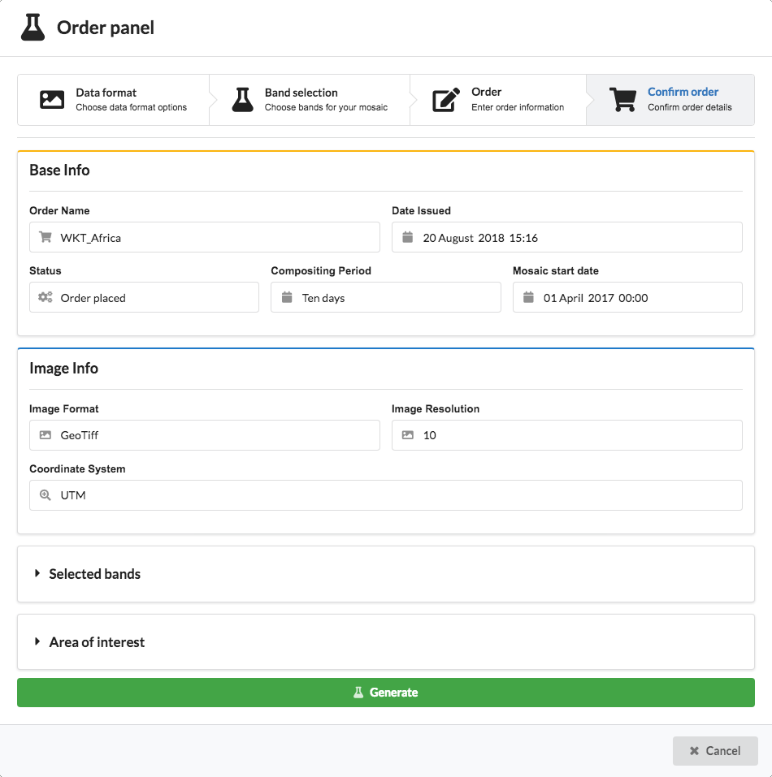

   Order Panel (Confirm Order)

If everything is correct, click on "**Generate**".

.. _time_series:

Time Series
===========

The definition of a time series is very similar to the definition of a mosaic.
A click on the button "**Time Series**" brings up the following page (see :numref:`timeSeriesDialog`):

.. _timeSeriesDialog:
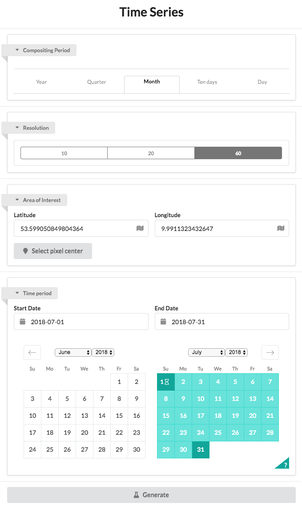

   Time Series Dialog Page

.. _timeSeriesPixels:
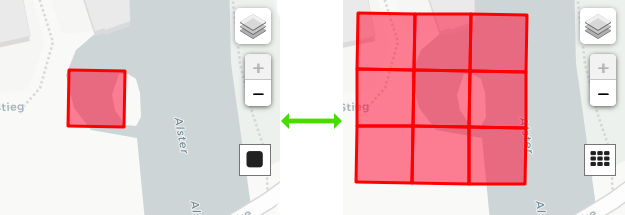

   Time Series Pixels

.. _timeSeriesGenerated:
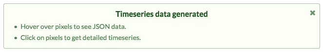

   Time Series Generated Message

.. _timeSeriesHover:
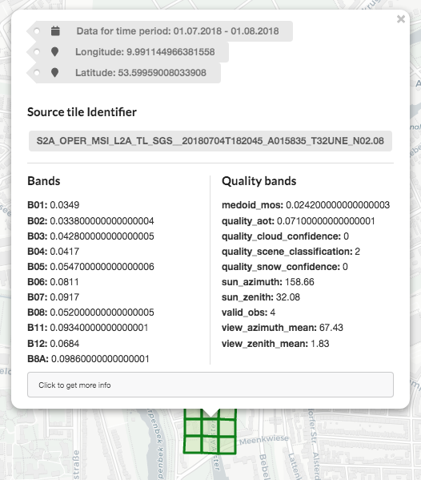

   Time Series Hover Display

.. _timeSeriesData:
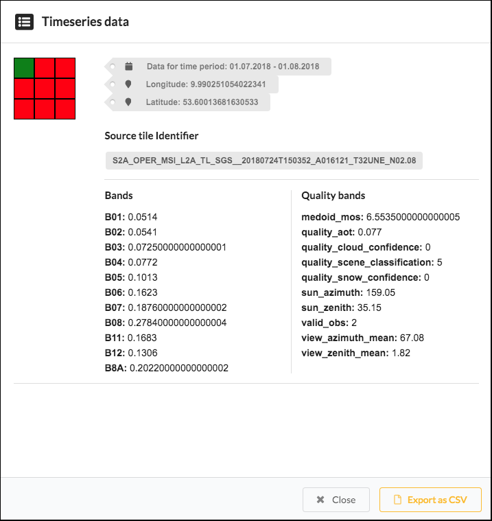

   Time Series Data

Compositing Periods
-------------------

Pixel Selection
---------------

User Area
*********
