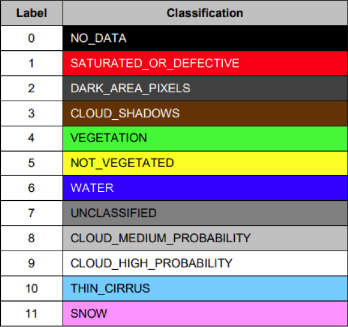
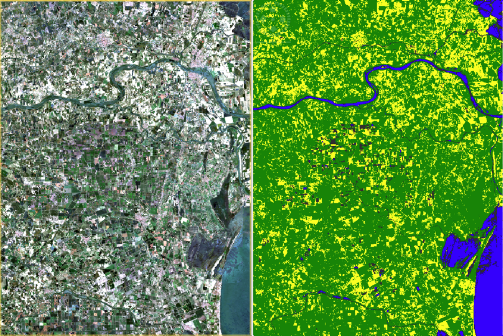

.. _prod_guide:

#############
Product Guide
#############

General
*******

All inputs products provide surface reflectance in eleven bands.
The surface reflectance is computed using the “Sentinel-2 Atmospheric Correction”
(L2A_AtmCorr) algorithm and based on reference radiative transfer code.
Look Up Tables (LUTs) are based on LibRadtran.

.. _surface_reflectance_bands:

Surface reflectance bands
=========================
The Mosaic Hub delivers products with reflectance bands chosen by the user in
the **Band selection** section of the Mosaic Hub order panel
(see section :ref:`Order Panel <orderPanel>`).

The following :ref:`table <surface_reflectance_bands_table>` lists the available bands and corresponding native
resolutions of the Sentinel-2 L2A input products.

.. _surface_reflectance_bands_table:
.. csv-table:: Sentinel-2 bands
   :file: csv/S2_bands.csv
   :header-rows: 1

.. _quality_indicator_bands:

Quality indicator bands
=======================
All products additionally provide quality indicator bands.

.. _quality_indicator_bands_table:
.. csv-table:: Quality Indicator bands
   :file: csv/quality_indicator_bands.csv
   :delim: ;
   :widths: 30, 60, 10
   :header-rows: 1

The following figure shows a list of all quality_scene_classification classes

.. _sceneClassifMap:

   Scene classification map classes

The following figure gives an example of an applied classification map:

.. _sceneClassifMapExample:

   Scene classification map example

.. _view_sun_geometry_bands:

View and sun geometry bands
===========================
The products additionally provide view and sun geometry information.

**Table #: View and sun geometry bands**

+--------------------+--------------------------------------+--------+
| Band name          |  Description                         | Unit   |
+====================+======================================+========+
| view_zenith_mean   | Mean view zenith angle of all bands  | Degree |
+--------------------+--------------------------------------+--------+
| view_azimuth_mean  | Mean view azimuth angle of all bands | Degree |
+--------------------+--------------------------------------+--------+
| sun_zenith         | Sun zenith angle                     | Degree |
+--------------------+--------------------------------------+--------+
| sun_azimuth        | Sun azimuth angle                    | Degree |
+--------------------+--------------------------------------+--------+

The products provide information on the validity of an observation (pixel).

.. _validation_bands:

Validation bands
================
**Table #: Validation bands**

+--------------------+-----------------------------------------------+--------+
| Band name          |  Description                                  | Unit   |
+====================+===============================================+========+
| source_index       | Index of the product used for this pixel. See | None   |
|                    | 'SourceProductIndices' element in metadata.   |        |
+--------------------+-----------------------------------------------+--------+

.. _medoid_bands:

Medoid quality bands
====================
Finally, a quality measure for the Medoid compositing algorithm is included.

**Table#: Medoid quality band**

+------------+-----------------------------------------------+--------+
| Band name  |  Description                                  | Unit   |
+============+===============================================+========+
| medoid_mos | The measure of spread of the medoid algorithm.| None   |
|            | Defined as sum of distances divided by number |        |
|            | of observations.                              |        |
+------------+-----------------------------------------------+--------+

The products additionally hold two bands with latitude and longitude information.

INSPIRE
*******

Coordinate Reference Systems
****************************

Software
********

SNAP
====

ArcGIS
======

QGIS
====

GeoTiff / Jpeg2000
******************

General
=======

Naming Convention and File Structure
====================================

Data Content
============

GeoTiff / Jpeg2000 Data Files
-----------------------------

Metadata
--------

NetCDF
******

General
=======

Naming Convention and File Structure
====================================

Data Content
============

NetCDf Data File
----------------

Metadata
--------

Time Series
***********

File Format
===========
