.. _prod_guide:

#############
Product Guide
#############

The content of Mosaic Hub products is variable and dependent on the selection done by the user during the order process.
The Product Guide describes all available content.

.. _data:

Data
****
All Mosaic Hub products provide 22 raster bands selectable by the user
during the order process (see section :ref:`Order Panel <orderPanel>`). Available
raster bands comprise:

- 11 surface reflectance bands
- 4 quality indicator bands
- 4 sun/view geometry bands
- 2 validation bands
- 1 quality band

The following chapter give more detailed information for the available bands.

.. _surface_reflectance_bands:

Surface reflectance bands
=========================
The Mosaic Hub delivers products with reflectance bands chosen by the user in
the **Band selection** section of the Mosaic Hub order panel
(see section :ref:`Order Panel <orderPanel>`).
The surface reflectance is computed using the “Sentinel-2 Atmospheric Correction”
(L2A_AtmCorr) algorithm and based on reference radiative transfer code.
Look Up Tables (LUTs) are based on LibRadtran.

The following :ref:`table <surface_reflectance_bands_table>` lists the available bands and corresponding native
resolutions of the Sentinel-2 L2A input products.

.. _surface_reflectance_bands_table:
.. csv-table:: Sentinel-2 bands
   :file: csv/S2_bands.csv
   :header-rows: 1

.. _quality_indicator_bands:

Quality indicator bands
=======================
All products additionally provide quality indicator bands, if selected.

.. _quality_indicator_bands_table:
.. csv-table:: Quality Indicator bands
   :file: csv/quality_indicator_bands.csv
   :delim: ;
   :widths: 30, 60, 10
   :header-rows: 1

|

The following figure shows a list of all quality_scene_classification classes

.. _sceneClassifMap:
.. figure:: images/ClassificationMap.png
   :name: ClassificationMapClassesName
   :scale: 100%
   :alt: Scene classification map classes
   :align: center

   Scene classification map classes

The following figure gives an example of an applied classification map:

.. _sceneClassifMapExample:
.. figure:: images/SceneClassificationMapExample.png
   :name: SceneClassificationMapExample
   :scale: 100%
   :alt: Scene classification map example
   :align: center

   Scene classification map example

.. _view_sun_geometry_bands:

View and sun geometry bands
===========================
The products additionally provide view and sun geometry information, if selected.

.. _view_and_sun_geometry_table:
.. csv-table:: View and sun geometry bands
   :file: csv/view_sun_geometry.csv
   :delim: ;
   :widths: 25, 45, 10
   :header-rows: 1

.. _validation_bands:

Validation bands
================
The products provide information on the validity of an observation (pixel), if selected.

.. _validation_bands_table:
.. csv-table:: Validation bands
   :file: csv/validation_bands.csv
   :delim: ;
   :widths: 10, 45, 10
   :header-rows: 1

.. _medoid_bands:

Medoid quality bands
====================
Finally, a quality measure for the Medoid compositing algorithm is included, if selected.

.. _medoid_bands_table:
.. csv-table:: Medoid quality bands
   :file: csv/medoid_quality_bands.csv
   :delim: ;
   :widths: 10, 45, 10
   :header-rows: 1

Resolution
**********
All Mosaic Hub raster products are provided in uniform resolution. Three different resolutions are available:

- 10m
- 20m
- 60m

.. _crs:

Coordinate Reference Systems (CRS)
**********************************
The Mosaic Hub raster products are provided either projected in UTM(WGS84) or unprojected WGS84

.. _utm:

UTM
===
Universal Transverse Mercator (UTM) conformal projection is not a single map projection.
The system instead divides the Earth into sixty zones, each being a six-degree band of longitude,
and uses a secant transverse Mercator projection in each zone. WGS84 is used as ellipsoid for UTM.

.. _wgs:

WGS84
=====
WGS84 is an Earth-centered, Earth-fixed terrestrial reference system and geodetic datum.
WGS84 is based on a consistent set of constants and model parameters that describe
the Earth's size, shape, and gravity and geomagnetic fields.

File Formats
************
The Mosaic Hub raster products are available in three different file formats:

- GeoTiff
- Jpeg2000
- NetCDF

File format properties are described in the following chapter. Where needed a
distinction is made between the different formats.

File Structure
==============
File structures are mainly identical for GeoTiff,
Jpeg2000 and NetCDF. Therefore, no explizit chapters for the single formats
exist. Differences are indicated within the single chapter.

.. _folders:

Folders
-------
The Mosaic Hub products are organized in a folder structure. The product's structure
consists of a base folder, containing all data of one order, a sub/tile folder
containing one or multiple folders, holding single product or tiles if a tiling is needed.
Within these sub folders the actual data is stored.

Structure example for GeoTiff format:

.. [Base folder]
   [Sub/tile folder]
      raster.tif

..      ...

..      raster.tif

..      metadata.xml
   [Sub/tile folder]
      raster.tif

..      ...

..      raster.tif

..      metadata.xml

.. _fileStructExample:
.. figure:: images/FileStructure.png
   :name: FileStructureExample
   :scale: 75%
   :alt: File structure example
   :align: center

   File structure example

.. _files:

Files
-----
Depending on the format the number of files varies.

GeoTiff/Jpeg2000:
    The product is delivered in 23 separate files. 22 GeoTiff/Jpeg2000 files
    contain the raster bands described in the :ref:`'Data' <data>` section, and one JSON file containing

NetCDF:
    The product is delivered in 2 seperate files. One NetCDF file containing
    all raster bands

.. _tiling:

Tiling
------
The product is split into the area of original Sentinel-2 granules.
For a detailed description of the Sentinel-2 tiling scheme please
visit the `official website`__. A tiling of the products is only done
if :ref:`UTM <utm>` projection is chosen as :ref:`CRS <crs>` and the
chosen area exceeds a certain size.

 .. _s2_tiling: https://sentinel.esa.int/web/sentinel/missions/sentinel-2/data-products

__ s2_tiling_

|

.. _naming_conventions:

Naming conventions
==================
Naming conventions are mainly identical for GeoTiff,
Jpeg2000 and NetCDF. Therefore, no explicit chapters for the single formats
exist. Differences are indicated within the single chapter

The product name (folders & files) contains key information on its content. Product names
support easy identification of relevant files and support meaningful sorting.
The Mosaic Hub product names are constructed according to the following naming convention:

Base folder
-----------

S2GM_{TemporalIdentifierSpatialIdentifier}_{PeriodStart}_{PeriodEnd}_{OrderName}_[ConfIndicator] _v{Version}_[{uniqueID}].{FileExtension}

In short, and with the correct length indicated by placeholders:

S2GM_{TSS}_{SSSSSSSS}_{EEEEEEEE}_{AA...AA}_[CCC]_v{X.Y.Z}_[DDD}.{ext}

Two examples:
    S2GM_Q10_20171001_20171230_MyPersonalRequest_STD__v1.0.0_385.tiff
    S2GM_M60_20170401_20170430_SPAIN_STD__v1.0.0_420.netCDF

.. _base_folder_table:

.. csv-table:: Base folder naming convention
   :file: csv/base_folder_naming_convention.csv
   :delim: ;
   :widths: 10, 60, 30
   :header-rows: 1

|

Sub folder
----------

The sub folder naming differs for tiled and none-tiled products (see :ref:`tiling <tiling>`).

*Non-tiled products*: The sub-folder name is equal to your order name (see {AA...AA} in :ref:`base folder table <base_folder_table>`)

*Tiled products*: The sub folder names are equal to Sentinel-2 granule names (see :ref:`tiling <tiling>`)

Files
-----
The file naming differs for GeoTiff/Jpeg2000 and NetCDF due to the structuring of the files.

**GeoTiff/Jpeg2000:**

In GeoTiff and Jpeg2000 format all raster bands are stored in separate files (see :ref:`Files <files>`)

{RasterBandIdentifier}_{TemporalIdentifierSpatialIdentifier}_{PeriodStart}_{OrderName}.{FileExtension}

In short, and with the correct length  indicated by placeholders (if not variable; variability indicated by ...):

{BB...BB}_{TSS}_{SSSSSSSS}_{AA...AA}.{ext}

*Example: B04_M60_20170701_Northern_Germany.jp2*

|

.. _file_naming_tif_jpg_table:

.. csv-table:: File naming convention GeoTiff/Jpeg200
   :file: csv/file_naming_convention_tif_jpg.csv
   :delim: ;
   :widths: 9, 32, 59
   :header-rows: 1

|

**NetCDF**

In NetCDF format all raster bands are stored in a single NetCDF (.nc) file (see :ref:`Files <files>`)

{TemporalIdentifierSpatialIdentifier}_{PeriodStart}_{OrderName}.{FileExtension}

In short, and with the correct length  indicated by placeholders (if not variable; variability indicated by ...):

{TSS}_{SSSSSSSS}_{AA...AA}.{ext}

*Example:*
    *M60_20170701_Northern_Germany.nc*

    *metadata_20170701_Northern_Germany.json*

|

.. _file_naming_netcdf_table:

.. csv-table:: File naming convention NetCDF
   :file: csv/file_naming_convention_netcdf.csv
   :delim: ;
   :widths: 9, 32, 59
   :header-rows: 1

The metadata file is prefixed with 'metadata/_'

Metadata
============

GeoTiff / Jpeg2000
------------------
json + xml

NetCDF
------
NetCDF internal + xml

.. _software:

Software
********

In this section you will get a brief introduction how to open Mosaic Hub products in three different software packages.

.. _snap:

SNAP
====
`SNAP`__ stands for Sentinel Aplication Platform and is the official ESA software and common architecture for all
Sentinel Toolboxes. It can be downloaded from http://step.esa.int/main/download/

.. _SnapWeb: http://step.esa.int/main/toolboxes/snap/

__ SnapWeb_

The simplest way of directly using the Mosaic Hub products is by using SNAP.
In SNAP you can simply select the .json file in the open file dialogue box or drag and drop
the .json file on the "Product Explorer" window. There is now difference if the product is
delivered in GeoTiff, Jpeg2000 or NetCDF format.

Open product:

- Select "File" -> "Open Products..." -> select ".json" file (see figure :ref:`4.4 <snapFileOpenOneExample>` and :ref:`4.5 <snapFileOpenTwoExample>`) or

- Drag & drop .json file on the "Product Explorer" part in SNAP (see figure 4.6).

.. _snapFileOpenOneExample:
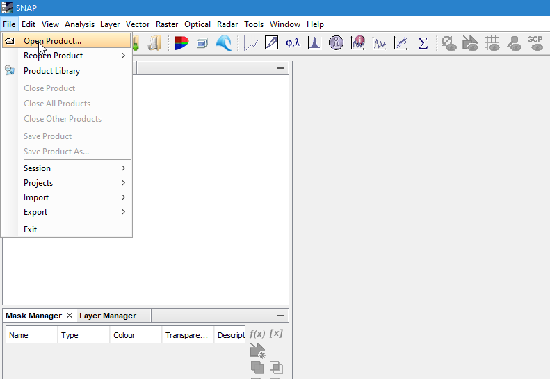

   SNAP example: open with file explorer

.. _snapFileOpenTwoExample:
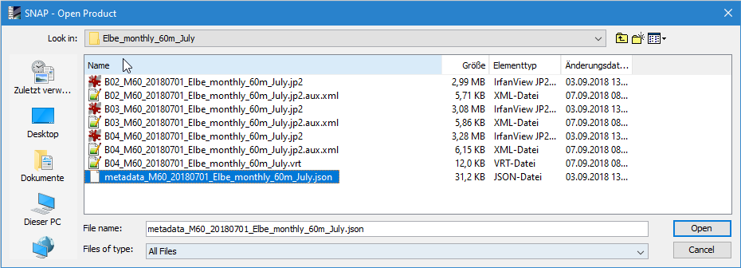

   SNAP example: select .json file

.. _snapFileDragDropExample:
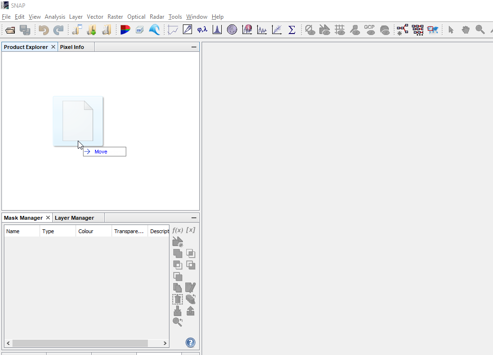

   SNAP example: open via drag & drop

Afterwards the product will be shown in the "Product Explorer" window. Now you can investigate the content of the
product by clicking on the "+" signs. To view the product right-click on the product name in the "Product Explorer" and
select :ref:`"Open RGB Image Window" <snapRGBrightClick>`. In the :ref:`"Select RGB-Image Channels" <snapRGBprofile>` window choose a band
combination that fits your needs. In this example the combination of Bands 4, 3, and 2 were used for RGB.

.. _snapRGBrightClick:
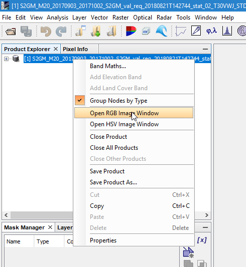

   SNAP example: open RGB view

.. _snapRGBprofile:
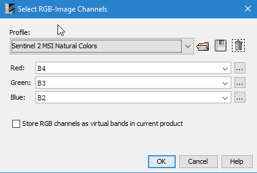

   SNAP example: select RGB profile (e.g. 4/3/2)

The selected RGB combination will be shown in a :ref:`new window <snapRGB>`.

.. _snapRGB:
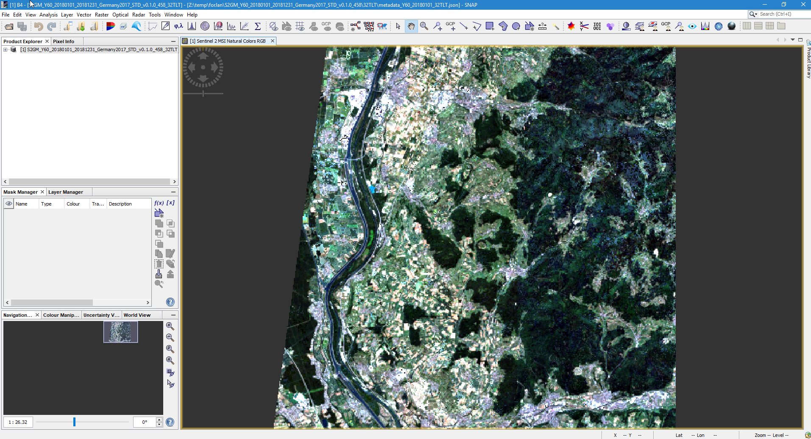

   SNAP example: RGB of bands 4/3/2

QGIS
====
For QGIS users it is a bit more complicated to visually inspect the product.

**GeoTiff/Jpeg2000**

You have two options of inspecting the data in QGIS. You can either load all single raster bands and inspect them as
grey scale images, or you can create a raster stack and inspect an RGB image. For the first option you can either:

- :ref:`Drag & drop <qgisFileOpenFour>` the single bands (.tiff/.jp2) directly on the "Layers" window or

- Use the :ref:`"Add Raster Layer" <qgisFileOpenOne>` button and :ref:`select the single files <qgisFileOpenTwo>` and :ref:`add them <qgisFileOpenThree>` to QGIS.

.. _qgisFileOpenFour:
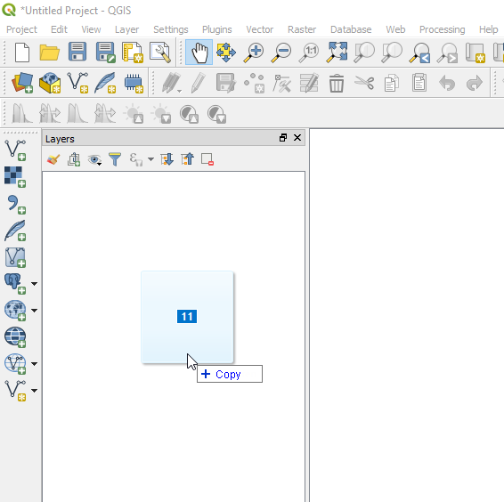

   QGIS example: drag & drop files

.. _qgisFileOpenOne:
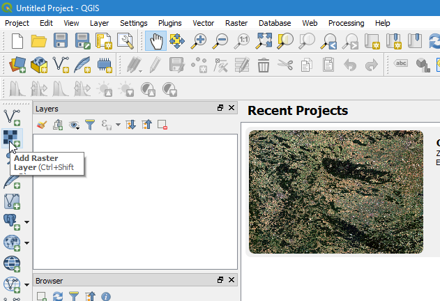

   QGIS example: open with "Add Raster Layer"

.. _qgisFileOpenTwo:
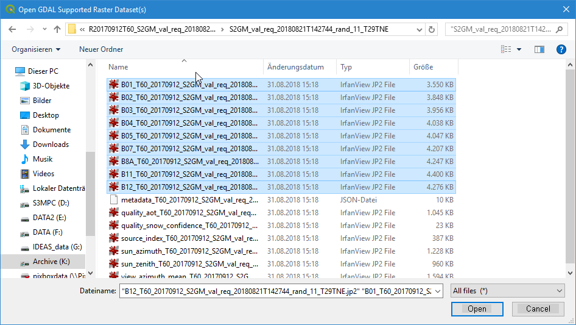

   QGIS example: select .jp2/.tiff files

.. _qgisFileOpenThree:
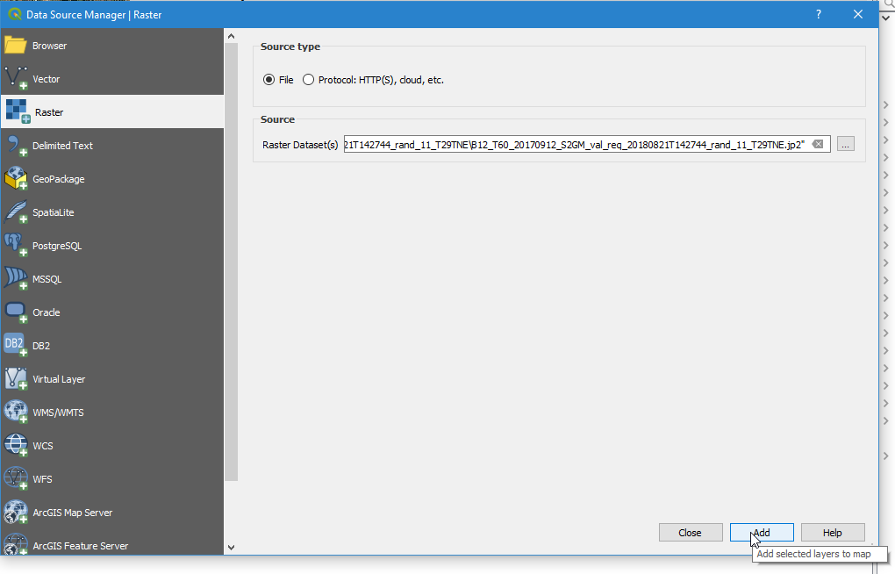

   QGIS example: load files into QGIS

If you use these two options you will end up with :ref:`single raster bands in QGIS <qgisFileOpenGrey>` which you can inspect es greyscale images.

.. _qgisFileOpenGrey:
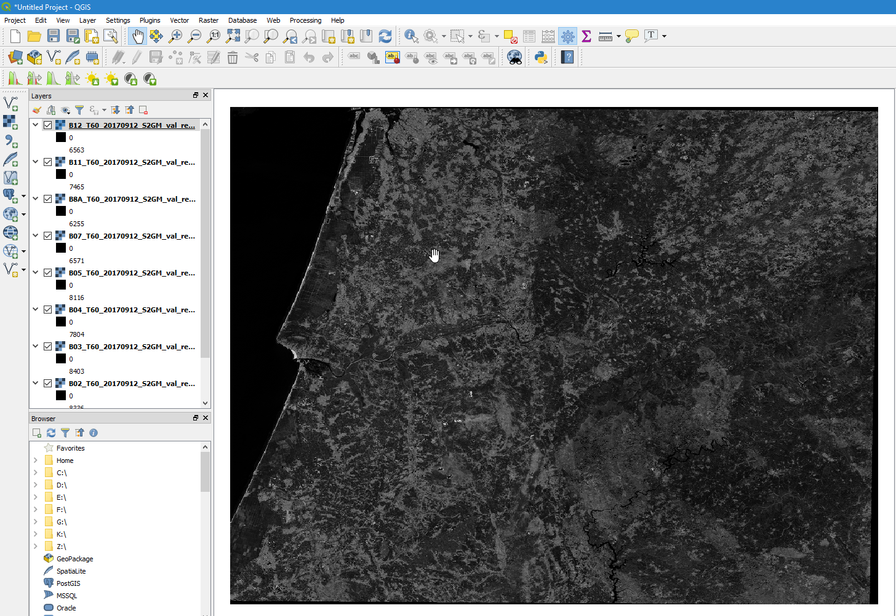

   QGIS example: single raster files as grey scale images

If you want to create a raster stack from which you can create an RGB view you first have to stack the single files.
For this again you have two options. Either you merge the data into a single raster stack or you create a virtual raster called VRT.

For the first option you must go to :ref:`"Raster" -> "Miscellaneous" -> "Merge..." <qgisRGBOne>`.
Click :ref:`Add files(s) <qgisRGBTwo>` and select the files you like to stack. Then click :ref:`OK <qgisRGBThree>`. Make sure you check the
:ref:`"Place each input file into a seperate band" <qgisRGBFive>` check-box. Click the [...] button and select
:ref:`Save to "File..." <qgisRGBFour>´ Depending on your preferences you can
choose between different output formats like GeoTiff. If you choose GeoTiff, it might be a good idea to build image
pyramids for faster display later on.

.. _qgisRGBOne:
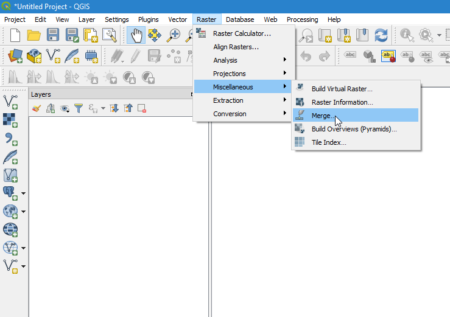

   QGIS example: Select "Merge..." tool

.. _qgisRGBTwo:
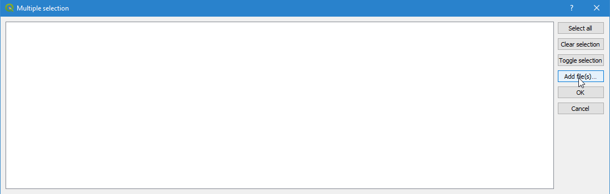

   QGIS example: Select files

.. _qgisRGBThree:
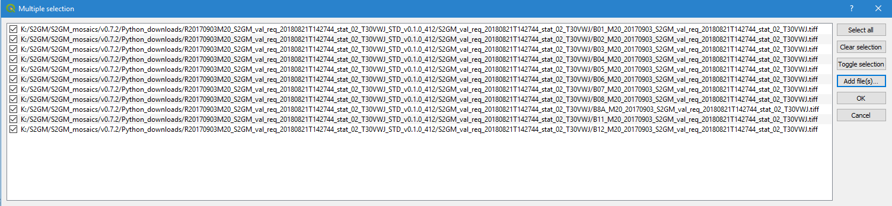

   QGIS example: Add files - OK

.. _qgisRGBFive:
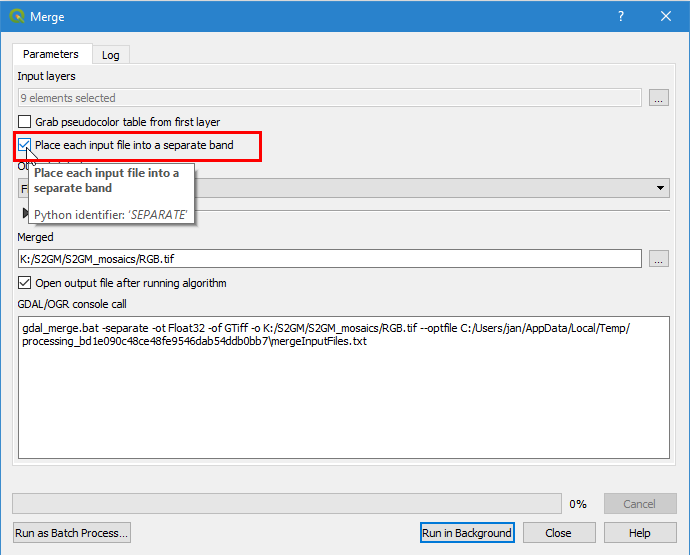

   QGIS example: Check tick-box for file separation

.. _qgisRGBFour:
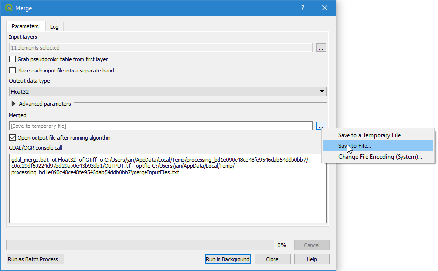

   QGIS example: Choose output format

If you decide to create a virtual raster stack (VRT), you must go to :ref:`"Raster" -> "Miscellaneous" -> "Build Virtual Raster..." <qgisRGBSix>`.
The steps are the same as for "Merge..". again make sure to check "separate".
The generated product is very small, as it is only a reference to the real data, but it will be slow for the display of bigger images.

.. _qgisRGBSix:
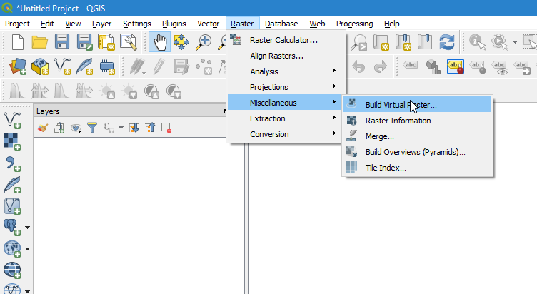

   QGIS example: Select "Build Virtual Raster..." tool

Once one of the two processes is finished the resulting layer stack will be loaded into QGIS.
Now you can open the :ref:`layer's property window and select the bands you like to view as an RGB <qgisRGBSeven>`.
For this example we have chosen R/G/B = 4/3/2. Afterwards your selection will be :ref:`displayed in QGIS <qgisRGBEight>`.

.. _qgisRGBSeven:
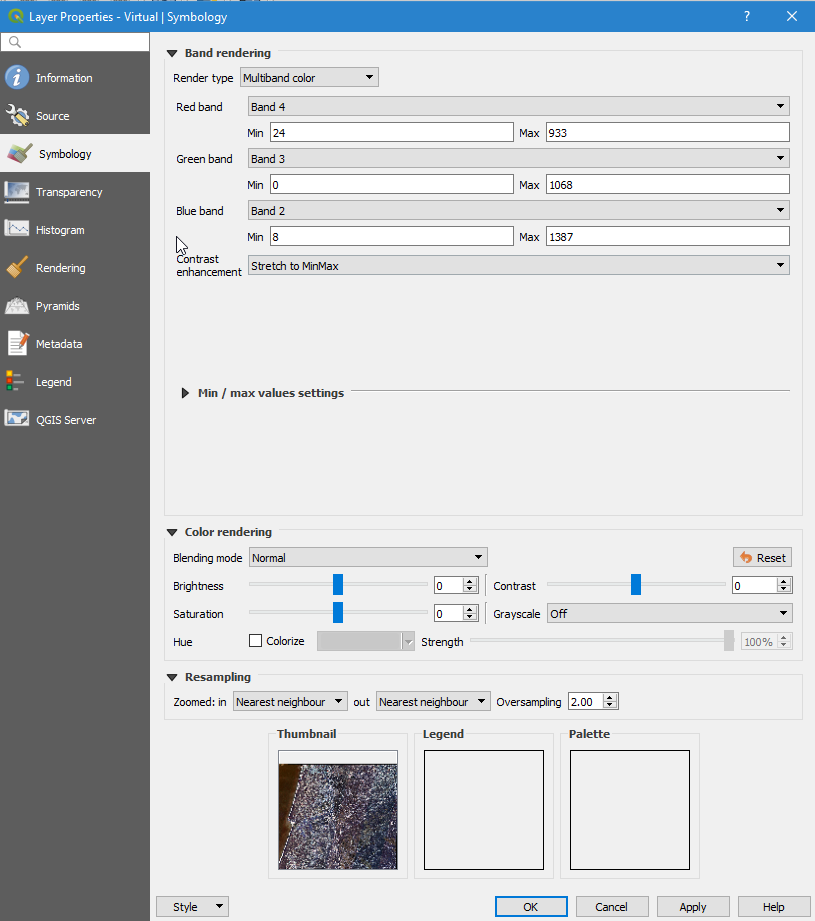

   QGIS example: Select band combination in properties window.

.. _qgisRGBEight:
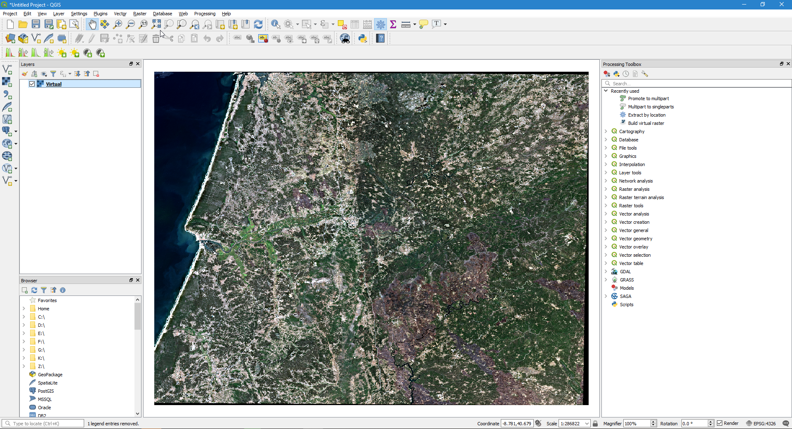

   QGIS example: RGB image bands 4/3/2 in QGIS

**NetCDF**
For NetCDF format there are small differences. Again, you can either use drag & drop or "Add Raster Layer" as described above.
After you have selected or dropped your NetCDF file a :ref:`new window opens where you can select the raster layer <qgisRGBNine>` of the
NetCDF you like to add. Afterwards you have to :ref:`indicate the CRS <qgisRGBTen>` you are using. All selected raster
bands will be :ref:`added to QGIS <qgisRGBEleven>`. Now you can proceed the same way as described above. Either you merge
the data or build a VRT. Either way, the added files will show up in the :ref:`file selection window <qgisRGBTwelve>`.
Therefore no files have to be added, just simply selected. All remaining
steps are the same as for GeoTiff/Jpeg2000

.. _qgisRGBNine:
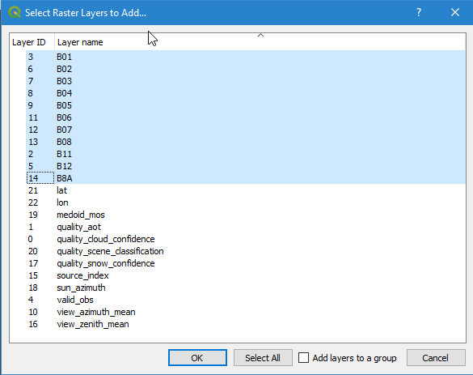

   QGIS example: Add NetCDF bands in QGIS

.. _qgisRGBTen:
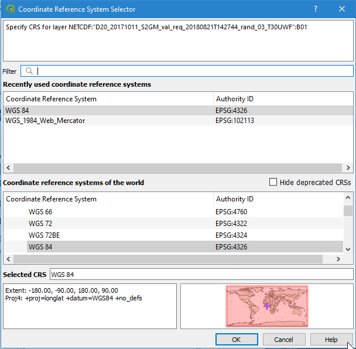

   QGIS example: Select CRS

.. _qgisRGBEleven:
.. figure:: images/QGIS_RGB11.png
   :name: qgisRGBElevenExample
   :scale: 75%
   :alt: QGIS open example
   :align: center

   QGIS example: All NetCDF raster bands are added to QGIS

.. _qgisRGBTwelve:
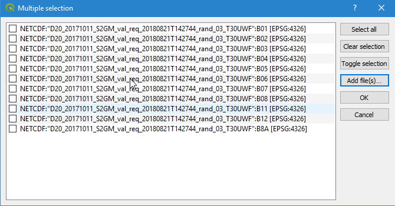

   QGIS example: Select files

Time Series
***********

Besides Raster products the Mosaic Hub provides the functionality of extracting time series of a single pixel or 3x3 pixel windows.
The result of those extractions can be exported and downloaded. For a full description of this functionality please see :ref:`TimeSeries<time_series>`

File Format
===========
The time series extracts are provided in CSV format.
